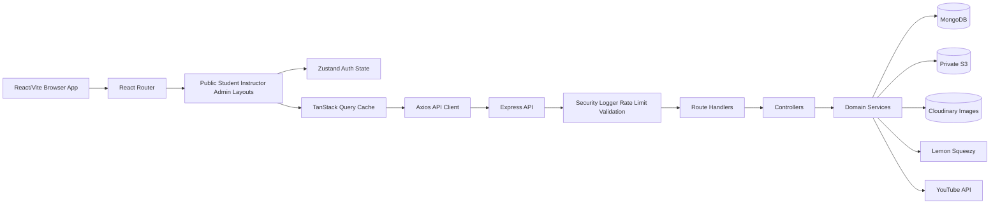
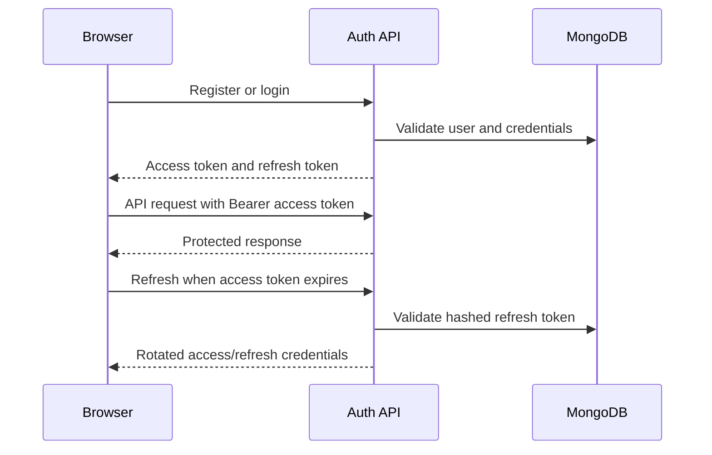
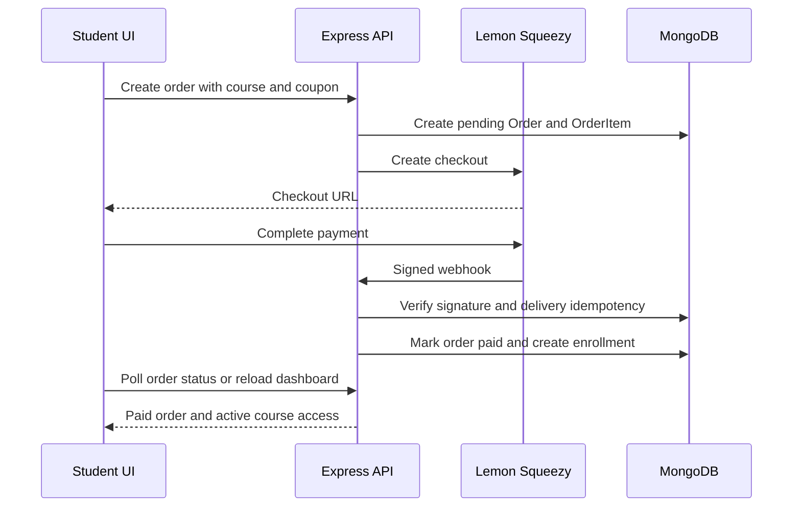
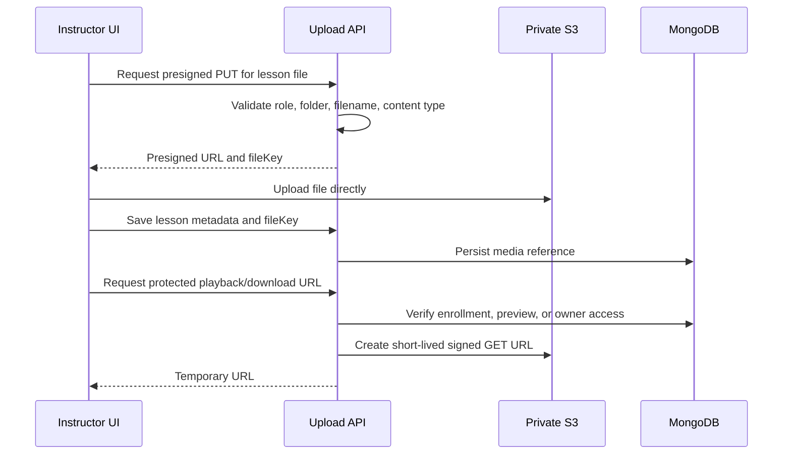
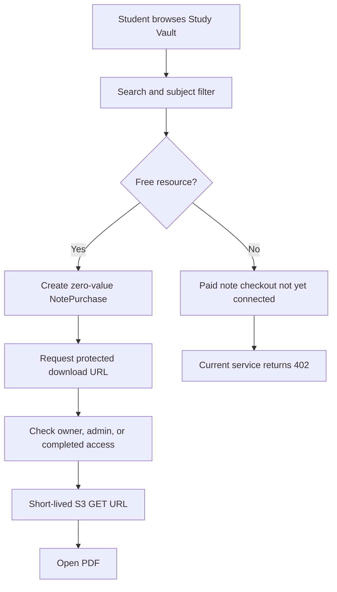
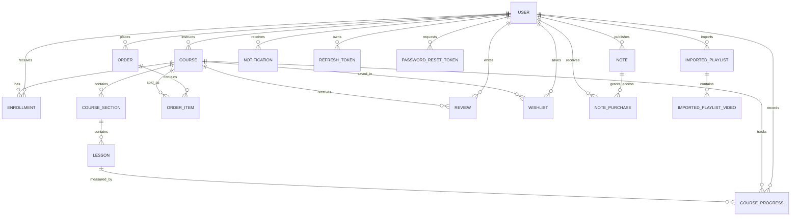

# Skillnest / Coursify Project Audit

**Audit date:** 2026-07-22  
**Repository:** `coursify`  
**Audit type:** Architecture, implementation, security, scalability, and production-readiness review  
**Scope:** Full repository review across `Frontend`, `Backend`, database models, integrations, documentation, and delivery configuration

## 1. Executive Summary

Skillnest (the current product name in the interface) is a substantial learning-platform foundation built with React/Vite on the frontend and Express/Mongoose on the backend. The project already supports the main learning lifecycle: authentication, role-based areas, course authoring, course browsing, enrollments, checkout foundations, learner progress, reviews, wishlists, coupons, notifications, YouTube Focus Mode, and the Study Vault free-note workflow.

The strongest parts of the system are the breadth of the domain model, the separation between route/controller/service layers, signed webhook verification with idempotency records, protected resource access, route-level frontend code splitting, and a working test foundation for several critical backend paths.

The main gap is the distance between a feature-complete development project and a production-grade platform. S3 has a useful presigned-upload foundation but not a complete media pipeline. Paid Study Vault checkout is explicitly not implemented. Lesson playback appears to bypass the protected signed-access path in the frontend. Horizontal scaling is not ready because rate limiting and maintenance jobs are process-local. There is no frontend/E2E test suite, no CI workflow, no queue/cache layer, and no production streaming/CDN strategy for video.

### Overall assessment

| Area | Estimated completion | Assessment |
|---|---:|---|
| Frontend product surface | 78% | Broad route coverage and polished responsive UI; test and accessibility depth are limited |
| Backend/API | 75% | Good domain coverage and service foundation; monolithic service organization and some contract drift |
| Database/domain model | 70% | Strong initial model coverage; relationships, counters, media lifecycle, and auditability need hardening |
| Authentication and authorization | 68% | Core JWT and role guards exist; email verification, recovery delivery, and hardening remain |
| Storage and media | 55% | Cloudinary and S3 presigned foundations exist; multipart, CDN, cleanup, and protected playback are incomplete |
| Payments | 62% | Course payment/webhook foundation exists; production reconciliation and paid notes remain |
| Testing and quality gates | 42% | Useful backend tests; no frontend tests, E2E suite, coverage gate, or CI observed |
| Security posture | 58% | Good baseline controls; production CORS, rate limiting, secrets, headers, and abuse controls need work |
| Scalability and operations | 40% | Suitable for development and small deployments, not yet for reliable horizontal scale |
| Documentation | 72% | Many useful documents exist, but README and implementation checklists have drift |
| **Overall project readiness** | **63%** | **Strong foundation, not yet production-ready for high-value or high-volume use** |

**Current grade: C.** This reflects a capable application foundation with meaningful working features, but several production blockers remain. It is not a quality judgment on the team; it is a risk-based release assessment.

## 2. Status Legend

- **Complete:** implemented and supported by the reviewed code path.
- **Partial:** foundation exists, but important cases, verification, or production hardening are missing.
- **Missing:** no implementation was found in the reviewed repository.
- **Risk:** implementation exists but may cause security, correctness, reliability, or maintenance problems.

## 3. Audit Method and Limits

The audit reviewed:

- Repository structure, package scripts, configuration examples, and ignore rules.
- Frontend entry points, routes, layouts, pages, shared components, state, API clients, and loading behavior.
- Backend bootstrap, routes, controllers, services, middleware, validators, utilities, jobs, scripts, and tests.
- Mongoose models, indexes, ownership fields, counters, and lifecycle relationships.
- S3, Cloudinary, YouTube, Lemon Squeezy, notifications, uploads, and Study Vault flows.
- Existing documentation and roadmap/checklist files.

This is a static engineering audit, not a penetration test, load test, accessibility certification, cloud-permission verification, or financial compliance review. Production conclusions must be validated in a staging environment with real service credentials and representative traffic.

## 4. Repository Map

| Area | Main location | Role |
|---|---|---|
| Frontend application | `Frontend/src` | React/Vite UI, routing, state, API calls, role-specific experiences |
| Backend application | `Backend` | Express API, authorization, business services, integrations |
| Domain models | `Backend/models/index.js` | Mongoose schemas and indexes |
| API routes | `Backend/routes` | HTTP endpoint definitions |
| Business logic | `Backend/services/index.js`, `Backend/services/playlists.js`, `Backend/services/upload.js` | Course, auth, payment, notes, playlist, and upload workflows |
| Cross-cutting concerns | `Backend/middlewares`, `Backend/utils` | Security, validation, errors, logging, storage, external providers |
| Backend tests | `Backend/test` | Node test runner unit and integration coverage |
| Product documentation | `README.md`, `document`, `things-to-implement`, `panding` | Setup, API, S3 notes, roadmap, and reference material |

### Structural observations

- The project is a monorepo-style repository with independent frontend and backend package manifests.
- Both applications have clear entry points and a shared root script layer.
- Several important layers are consolidated into large files. This is practical early in a project but will slow changes as domain complexity grows.
- The product name is inconsistent: the interface uses Skillnest while packages, backend text, and older documentation still use Coursify.
- Generated/build artifacts should be reviewed before future commits. `Frontend/dist-check` changes were present in the repository history and should not be treated as source of truth.

## 5. Architecture Overview

### Architectural strengths

- Business logic is mostly kept out of route declarations.
- API calls are centralized in `Frontend/src/services/api.js`.
- Protected route and role guard concepts are explicit on the frontend.
- Backend authorization middleware and service-level ownership checks are present.
- Webhook delivery persistence provides a foundation for idempotent payment processing.
- Private media is intended to be stored outside MongoDB, with object keys rather than permanent public URLs.

### Architectural risks

- `Backend/services/index.js` is a large domain monolith. It increases change collision risk and makes unit isolation difficult.
- `Backend/models/index.js`, `Backend/controllers/index.js`, and `Backend/validators/index.js` centralize many unrelated domains.
- In-process rate limiting and maintenance work prevent safe horizontal scaling.
- The frontend and backend have a possible development-port contract mismatch: the frontend fallback is `http://localhost:3000/api`, while `Backend/.env.example` uses `PORT=3002`.
- Media access contracts are not consistently consumed by the frontend player.

## 6. Primary User Flows

### Authentication flow

### Course purchase and enrollment flow

### Media upload and access flow

**Important:** the upload foundation is present, but the reviewed lesson player appears to render stored `videoUrl`, `content`, or `fileUrl` values directly in `Frontend/src/pages/student/LessonPlayer.jsx`. The backend has a signed lesson-access capability, so the final access contract needs to be made consistent before production.

### Study Vault flow

## 7. Frontend Audit

### 7.1 Bootstrap, routing, and global state

**Files:** `Frontend/src/main.jsx`, `Frontend/src/App.jsx`, `Frontend/src/routes/index.jsx`, `Frontend/src/store/authStore.js`

| Topic | Status | Findings |
|---|---|---|
| React/Vite bootstrap | Complete | Query client, router, toast provider, and app bootstrap are wired |
| Route-level lazy loading | Complete | Major pages are loaded through `React.lazy` and `Suspense` |
| Error boundary | Complete | Global error boundary exists in `App.jsx`; recovery and reporting can be improved |
| Auth bootstrap | Partial | Refresh-token restoration exists, but startup behavior should be tested on expired and revoked sessions |
| Query caching | Partial | Useful defaults exist; invalidation conventions need a documented policy per domain |
| State ownership | Partial | Zustand auth state and TanStack Query server state are appropriate, but large pages still contain substantial local orchestration |
| Scroll/history behavior | Complete | Route history and scroll restoration are implemented |

**Risks and improvements**

- Add a typed, centralized API response/error contract or migrate the client to TypeScript incrementally.
- Define query keys and invalidation rules per domain rather than relying on page-level refreshes.
- Add error-boundary telemetry with privacy-safe context.
- Verify that auth bootstrap does not briefly render protected content before the refresh decision completes.

### 7.2 Routing and access control

**Files:** `Frontend/src/routes/index.jsx`, `Frontend/src/components/common/ProtectedRoute.jsx`, `Frontend/src/components/common/RoleGuard.jsx`

- Public, student, instructor, and admin route groups are clearly represented.
- `ProtectedRoute` preserves the original destination through navigation state.
- `RoleGuard` provides client-side role gating, but backend authorization remains the real security boundary.
- Study Vault marketplace `/notes` is currently protected in the frontend even though the list API is public. Decide whether browsing should be public and align product copy, route protection, and API documentation.
- Add route tests for direct navigation, refresh, unauthorized access, role mismatch, and return-to-origin behavior.

### 7.3 Public product surface

**Files:** `Frontend/src/pages/public/Home.jsx`, `CourseList.jsx`, `CourseDetail.jsx`, `Checkout.jsx`, `NotesMarketplace.jsx`, `FocusPlaylists.jsx`, `PlaylistImport.jsx`, `PlaylistDetail.jsx`, `PlaylistWatch.jsx`, `Login.jsx`, `Register.jsx`, `ForgotPassword.jsx`, `ResetPassword.jsx`

| Area | Status | Findings |
|---|---|---|
| Home/marketing | Complete | Strong product narrative, hero, course discovery, learning paths, FAQ/CTA/footer concepts |
| Course list | Complete | Search, filters, cards, pagination, loading and error states exist |
| Course detail | Partial | Discovery and preview are present; signed lesson access and content lifecycle need verification |
| Checkout | Partial | Course checkout and redirect/polling foundations exist; real provider staging verification is required |
| Notes marketplace | Partial | Free Study Vault flow is implemented; paid resources and public browsing policy remain |
| Focus Mode | Partial | YouTube playlist import/watch/progress foundation exists; quota and availability errors need stronger UX |
| Auth pages | Complete for core flow | Reset delivery and email verification are not production-complete |

**Product inconsistencies**

- Navbar search language suggests courses, notes, and playlists, while the reviewed search behavior is primarily course-oriented.
- Branding is split between Skillnest and Coursify in visible text, API/docs, and repository metadata.
- Some older content and documentation contain encoding artifacts such as mojibake currency or punctuation.

### 7.4 Student experience

**Files:** `Frontend/src/pages/student`, `Frontend/src/layouts/StudentLayout.jsx`, `Frontend/src/components/common/YouTubePlayer.jsx`

Implemented foundations:

- Student dashboard and course list.
- Enrolled course and lesson player views.
- Order history, wishlist, profile, and Study Vault.
- Course progress and playlist resume concepts.
- Protected student routes and sidebar navigation.

Gaps and risks:

- Lesson video access should use a short-lived signed URL or CDN token, not a permanent stored URL.
- The native video element does not provide HLS/DASH adaptive streaming, poster strategy, preload policy, retry state, or playback telemetry.
- PDF display is a basic iframe/open flow and needs browser/device testing.
- “Bookmarks” or lesson-level saved points are not implemented; wishlist is a course-level feature and should not be described as bookmarks.
- Continue-watching and history need an explicit product definition across courses and Focus Mode.

### 7.5 Instructor experience

**Files:** `Frontend/src/pages/instructor`, `Frontend/src/pages/instructor/CourseEditor.jsx`, `Frontend/src/pages/instructor/NotesManagement.jsx`

Implemented foundations:

- Instructor dashboard, course management, course editor, statistics, profile, and Study Vault management.
- Cloudinary image upload path for thumbnails/avatars.
- S3 presigned upload path for lesson PDFs/videos and Study Vault PDFs.
- Publish/unpublish controls and metadata forms.

Gaps and risks:

- Uploads are one-shot PUTs rather than resumable multipart uploads.
- Upload UI needs progress, cancellation, retry, size validation, checksum/ETag handling, and stale-session recovery.
- The course editor must reliably persist the returned S3 `fileKey` and use it for protected access.
- Deleting or replacing media needs an orphan cleanup policy.
- Instructor analytics are summary counters rather than event-based analytics.
- Notes management has no paid-note checkout integration, moderation workflow, or content preview pipeline.

### 7.6 Admin experience

**Files:** `Frontend/src/pages/admin`, `Frontend/src/layouts/AdminLayout.jsx`

Implemented foundations:

- Admin dashboard, users, courses, categories, coupons, and orders.
- Role-gated navigation and backend role middleware.
- Basic status and management operations.

Gaps:

- No complete audit-log UI or immutable administrative action history.
- Role management and sensitive account operations need stronger confirmation and auditing.
- Course/note moderation is not a full review queue.
- Operational dashboards do not cover queue health, storage failures, webhook lag, or provider health.

### 7.7 Shared UI, responsive design, and accessibility

**Files:** `Frontend/src/components/common`, `Frontend/src/components/layout`, `Frontend/src/components/ui`, `Frontend/src/index.css`

Strengths:

- Shared loading, empty, error, pagination, card, sidebar, and navigation patterns exist.
- Responsive work has been actively applied across the landing page, navbar, trending courses, announcement, and footer.
- Theme toggle and dark/light visual language are established.
- Framer Motion is used for purposeful page and card transitions.

Improvements:

- Run automated axe checks and keyboard-only walkthroughs across all role layouts.
- Validate focus visibility, menu focus trapping, escape handling, reduced-motion behavior, and screen-reader labels.
- Add stable dimensions and `loading="lazy"`/`decoding="async"` to image-heavy lists where appropriate.
- Ensure mobile navigation overlays content rather than changing document flow, and test at several narrow widths.
- Add visual regression screenshots for navbar, hero, course cards, Study Vault cards, and footer.

## 8. Backend Audit

### 8.1 Application bootstrap and configuration

**Files:** `Backend/index.js`, `Backend/config.js`, `Backend/.env.example`, `Backend/package.json`

Implemented:

- Express app bootstrap and route mounting.
- MongoDB connection and maintenance job startup.
- Environment validation for core database/JWT settings.
- JSON parsing with raw-body capture for webhook signature validation.
- Central not-found and error handling.
- CORS, security headers, request IDs, and request logging.

Risks:

- CORS falls back to `origin: true` with credentials when no allowlist is configured. This is unsafe as a production default; fail closed outside local development.
- `PORT` defaults differ between frontend expectations and backend example configuration.
- Optional integrations are not all validated at startup, so missing S3, YouTube, or payment configuration may be discovered only during a user request.
- There is no explicit trust-proxy configuration for deployments behind a load balancer.
- `express.json` allows a 10 MB body, which is too large for many APIs and still unsuitable for file uploads; upload bytes should go directly to storage.

### 8.2 Routes, controllers, and API contracts

**Files:** `Backend/routes/*.js`, `Backend/controllers/index.js`, `Backend/API_DOCUMENTATION.md`, `Frontend/src/services/api.js`

Route domains include authentication, users, courses, enrollments, orders, social features, dashboards, uploads, platform data, playlists, and notes.

Strengths:

- Route concerns are separated by domain.
- Controller/service boundaries are present.
- Authentication and role middleware are applied to sensitive route groups.
- Error responses are normalized by central middleware.

Contract issues:

- Dynamic route parameters are not uniformly validated as Mongo ObjectIds before service calls. This causes errors such as `Cast to ObjectId failed for value "undefined"` to surface when frontend identifiers are missing and creates inconsistent API behavior.
- Notes list responses and other paginated list responses are not completely standardized. The notes API currently does not provide the same pagination envelope used by other list endpoints.
- Frontend API unwrapping and backend response shapes should be formally documented and tested.
- API documentation has drifted from the current Study Vault implementation and branding.
- Add request schemas for route params and query strings consistently, then reject missing IDs before reaching Mongoose.

### 8.3 Services and business logic

**Files:** `Backend/services/index.js`, `Backend/services/playlists.js`, `Backend/services/upload.js`

Implemented domains include:

- Authentication and user management.
- Course and lesson management.
- Enrollment and progress.
- Orders, coupons, checkout creation, webhook reconciliation, and refunds.
- Reviews, ratings, wishlists, notifications, dashboards, and platform data.
- Study Vault notes and note access.
- Upload authorization and storage preparation.
- YouTube playlist import/playback support.

Primary maintainability concern:

- `Backend/services/index.js` is a large monolith of unrelated business domains. Split it into modules such as `authService`, `courseService`, `enrollmentService`, `orderService`, `noteService`, `notificationService`, `dashboardService`, and `adminService`, with shared transaction/access utilities.

Correctness concerns to verify:

- Course counters, ratings, enrollment counts, note purchase counts, and download counts are denormalized. Updates must be atomic and periodically reconcilable.
- Course, note, and media deletion paths need explicit cleanup and failure compensation.
- Ownership checks should be consistently enforced in services, not only at route level.
- Payment and refund operations need state-machine guards to prevent invalid transitions.

### 8.4 Middleware, validation, logging, and errors

**Files:** `Backend/middlewares/auth.js`, `error.js`, `rateLimit.js`, `security.js`, `requestLogger.js`, `validate.js`, `Backend/utils/logger.js`

Strengths:

- JWT bearer authentication and role middleware exist.
- Zod validation middleware exists and replaces parsed request data.
- Central error mapping handles common Zod, Mongoose, CastError, duplicate-key, and provider failures.
- Request logging includes request IDs and sensitive-data redaction.
- Webhook raw-body handling and signature validation are represented.

Risks:

- The rate limiter is an in-memory `Map`, keyed by URL/IP. It is not shared across processes, can be bypassed or inconsistent behind proxies, and may grow with high-cardinality URLs.
- Production should use Redis or a provider-level gateway limiter, with explicit proxy configuration and route-specific budgets.
- Security headers are a baseline only. Add CSP, HSTS in HTTPS environments, Permissions-Policy, and a deliberate frame policy where needed.
- Error and request logs should be shipped to centralized structured logging with retention and alerting.
- Password-reset and authentication flows need abuse monitoring and provider-backed delivery.

### 8.5 Background jobs and operations

**Files:** `Backend/jobs/maintenance.js`, `Backend/scripts`

- The maintenance job currently handles coupon reservation cleanup in-process.
- This is acceptable for one process but not reliable across multiple replicas or restarts.
- Move recurring work to a durable scheduler/queue and make jobs idempotent.
- Add jobs for orphaned S3 object cleanup, stale upload sessions, webhook retries, counter reconciliation, email delivery, and expired access/session cleanup.

## 9. Database and Domain Model Review

**Primary file:** `Backend/models/index.js`

### Model inventory

| Model | Status | Purpose and review |
|---|---|---|
| User | Complete | Identity, credentials, role, profile, status; needs verification/security fields |
| Category | Complete | Course classification and ordering; deletion dependencies need policy |
| Course | Partial | Core catalog and counters; needs media lifecycle and counter reconciliation |
| CourseSection | Complete | Ordered course grouping; unique ordering index exists |
| Lesson | Partial | Supports video/text/PDF/quiz fields; media fields and protected access need consistency |
| Enrollment | Complete | Learner access/progress summary; overlaps with progress records |
| Order | Partial | Course payment record; payment transaction/refund state can be more explicit |
| OrderItem | Complete | Purchase line items and historical price |
| Review | Complete | One review per user/course; rating aggregation needs robust reconciliation |
| Wishlist | Complete | Unique user/course saved item |
| CourseProgress | Complete | Per-lesson progress; transaction/update consistency needs tests |
| ImportedPlaylist | Partial | YouTube import metadata and resume state; quota and sync lifecycle incomplete |
| ImportedPlaylistVideo | Partial | Imported video progress; availability and provider changes need handling |
| Coupon | Complete foundation | Reservation/redeem counts and expiry; distributed job execution missing |
| Notification | Partial | In-app notifications; delivery channels and retention policies missing |
| RefreshToken | Complete foundation | Hashed persistent refresh token with TTL |
| PasswordResetToken | Partial | Hashed token with TTL; email delivery and token disclosure policy incomplete |
| WebhookDelivery | Complete foundation | Idempotency, retries, status, and retention record |
| Note | Partial | Study Vault metadata and S3 key; paid flow, thumbnails, and cleanup incomplete |
| NotePurchase | Partial | Free access and future paid access; payment provider relation is not complete |

### Relationship diagram

### Database findings

- Many ObjectId fields do not declare Mongoose `ref` metadata. This limits consistent `populate` usage and makes relationship intent less clear. Add refs where population is an intentional supported behavior.
- `NotePurchase.noteId` now declares `ref: "Note"`, but the broader model relationship strategy should be made consistent.
- `Enrollment.completedLessonIds` and `CourseProgress` represent overlapping progress state. Define one source of truth or document the synchronization invariant.
- Denormalized counters need atomic updates, reconciliation jobs, and tests for retries and duplicate events.
- There is no first-class media asset/upload session model. This makes resumable uploads, cleanup, virus scanning, and lifecycle tracking harder.
- There is no audit log model for sensitive admin, payment, role, publication, or access actions.
- There is no email delivery, cart, payment transaction, certificate, analytics event, or activity-history model.
- Add compound indexes based on real query plans after staging load tests. Avoid adding indexes speculatively.
- Data retention, deletion/anonymization, and account closure policies are not documented.

## 10. Storage and Media Audit

### 10.1 Cloudinary image storage

**Files:** `Backend/utils/cloudinary.js`, `Backend/services/upload.js`, `Backend/routes/uploads.js`

**Status: Partial.** Signed server-side base64 upload support exists for avatars and course thumbnails.

Completed:

- Cloudinary configuration and signed upload utility.
- Allowed image extension/content types are constrained at the application layer.
- Frontend course editor and profile flows can submit image data.

Remaining:

- Base64 uploads increase request memory and are not suitable for large or numerous images.
- Validate file size, dimensions, magic bytes, and image processing failures.
- Add transformations/responsive variants and consistent quality settings.
- Add replacement/deletion cleanup to avoid orphaned assets.
- Store provider public IDs, not only URLs, when deletion or transformation is required.

### 10.2 Amazon S3 file storage

**Files:** `Backend/utils/s3.js`, `Backend/services/upload.js`, `Backend/routes/uploads.js`, `document/s3`, `Frontend/src/pages/instructor/CourseEditor.jsx`, `Frontend/src/pages/instructor/NotesManagement.jsx`

**Status: Partial foundation; not production-complete.**

Completed:

- Custom AWS Signature Version 4 presigned PUT/GET generation.
- Private object-key strategy for lesson files and Study Vault notes.
- Folder allowlist and content-type allowlist.
- Short-lived upload and download URLs.
- Direct browser-to-S3 upload avoids routing large file bytes through Express.
- S3 environment validation fails clearly when credentials are absent.

Missing or incomplete:

- No multipart upload/session API for large files, resumability, pause/resume, retry, complete, or abort.
- No upload progress contract beyond browser PUT progress.
- No HEAD/existence verification after upload.
- No checksum/integrity validation or malware scanning hook.
- No S3 delete utility or orphan cleanup job.
- No CloudFront/private CDN playback path.
- No range-aware or adaptive video delivery strategy.
- No lifecycle rules documented for incomplete multipart uploads or old objects.
- Production bucket policy/CORS/private access verification is still outstanding according to `document/s3/04-open-issues.txt`.
- S3 configuration was not available in the local environment during the earlier review, so end-to-end cloud validation remains pending.

### Recommended production media architecture

1. Browser requests an upload session from the API.
2. API validates user, role, file category, size, content type, and target entity.
3. API creates a database `UploadSession` and S3 multipart upload.
4. Browser uploads parts directly to S3 using short-lived presigned URLs.
5. Browser reports part ETags; API completes the multipart upload after validation.
6. A worker verifies object metadata, scans the object, and marks the media ready.
7. API stores only the immutable object key and media metadata in MongoDB.
8. Playback/download is authorized by the API and delivered through CloudFront signed URLs/cookies or a protected origin path.

This should be implemented for videos and large PDFs before inviting many instructors to upload production content.

## 11. Payments and Commerce Audit

**Files:** `Backend/utils/lemonSqueezy.js`, order routes/services, `Frontend/src/pages/public/Checkout.jsx`, `Frontend/src/hooks/useCheckout.js`, `Backend/API_DOCUMENTATION.md`

### Course commerce

**Status: Partial-to-strong foundation.**

- Pending orders, line items, coupons, checkout creation, signed webhook processing, idempotency, enrollment creation, and refund-related handling exist.
- Webhook records in `WebhookDelivery` are a good foundation for retry-safe reconciliation.
- Real provider credentials, delayed webhook behavior, refund edge cases, and staging-to-production verification remain.

### Study Vault commerce

**Status: Missing for paid resources.**

- Free-note access creates a zero-value `NotePurchase` and can be protected by the download endpoint.
- Paid notes currently return `Paid note checkout is not configured yet` / HTTP 402.
- There is no note-specific checkout metadata, provider reconciliation path, paid-note refund policy, or paid-note end-to-end test.

### Recommended payment work

- Model provider transaction IDs and payment state transitions explicitly.
- Add note ID and resource type to checkout metadata.
- Reconcile provider events idempotently for paid notes, refunds, chargebacks, and disputes.
- Define access behavior for pending, paid, refunded, and expired states.
- Add an order detail/audit trail for support staff.
- Never trust frontend prices; calculate prices from current server-side records.

## 12. Authentication, Authorization, and Security

### Current controls

- JWT access and refresh token flow.
- Persistent hashed refresh tokens and TTL cleanup.
- Role middleware for student, instructor, and admin areas.
- Zod request validation on many routes.
- Password hashing and reset-token storage foundations.
- Signed webhook verification.
- Security headers baseline.
- Sensitive request log redaction.
- Auth route rate limits.

### High-priority risks

| Priority | Risk | Location | Required action |
|---|---|---|---|
| P0 | Permissive CORS fallback with credentials | `Backend/index.js` | Fail closed in non-development environments; allow only configured origins |
| P0 | Protected media access contract may be bypassed by direct URLs | `Frontend/src/pages/student/LessonPlayer.jsx`, lesson access backend route | Require API authorization before every lesson media URL and use private CDN/S3 delivery |
| P1 | In-memory rate limiting does not scale | `Backend/middlewares/rateLimit.js` | Move counters to Redis/API gateway; configure trust proxy |
| P1 | Password recovery delivery is not production-ready | auth routes/services, `Backend/config.js` | Add verified email provider, templates, throttling, and token disclosure policy |
| P1 | Missing CSP/HSTS/Permissions-Policy | `Backend/middlewares/security.js` | Add environment-aware hardened headers |
| P1 | Missing audit trail for sensitive actions | database and admin areas | Add append-only audit events and admin viewer |
| P1 | File validation is application-only | upload utilities | Validate size, magic bytes, malware, and object metadata |
| P2 | Access and counter events lack broad monitoring | services/jobs | Add structured security and business metrics |

### Additional security recommendations

- Prefer secure, httpOnly, sameSite refresh cookies over localStorage for long-lived refresh credentials if the deployment model allows it; otherwise enforce a strong CSP and XSS defense-in-depth.
- Add account lockout or adaptive throttling for repeated credential failures.
- Validate all route IDs and ownership before Mongoose operations.
- Add authorization tests for every role and ownership boundary.
- Do not expose reset tokens in production responses or logs.
- Store secrets only in the deployment secret manager and rotate them.
- Add dependency and secret scanning to CI.

## 13. Performance and Scalability Audit

### Current positives

- Frontend route-level lazy loading is already implemented.
- TanStack Query reduces duplicate requests and provides caching.
- Direct-to-S3 upload avoids API server bandwidth for large files.
- Many list endpoints use pagination utilities.
- Mongo indexes exist for important ownership, ordering, and uniqueness constraints.

### Current bottlenecks

| Area | Current state | Scaling impact | Improvement |
|---|---|---|---|
| API rate limits | Process-local map | Inconsistent across replicas; memory growth | Redis or gateway limiter |
| Maintenance jobs | Process-local timer | Duplicate/missed work on replicas/restarts | Durable queue/scheduler |
| Video delivery | Direct file/native video | Slow startup, expensive origin traffic, no adaptation | Transcode HLS/DASH and serve via CDN |
| Uploads | Single PUT | Large files fail/restart from zero | S3 multipart/resumable upload |
| Images | Base64 request upload | Memory/latency pressure | Direct signed Cloudinary upload and variants |
| Caching | No shared cache | Repeated catalog/dashboard work | Redis/cache headers/CDN for public data |
| Search | Basic database queries | Limited relevance and scale | Indexed search or Atlas Search when needed |
| Observability | Request logging only | Slow diagnosis and capacity planning | Metrics, traces, alerts, provider dashboards |
| Frontend bundle | Vite warns about a chunk above 500 KB | Slower first load on constrained devices | Analyze chunks, split heavy dependencies, compress |
| Notes pagination | Incomplete | Large marketplace response growth | Standard paginated contract |

### Capacity guidance

- For approximately 100 concurrent users, the current design can work with correct environment configuration and a single modest API instance, assuming low video traffic and small files.
- For approximately 1,000 simultaneous users, do not simply increase server size. Add a load balancer, multiple stateless API replicas, shared Redis rate limits/cache, managed MongoDB sizing, CDN media delivery, durable jobs, centralized logs, and provider quotas.
- Video traffic is the first likely bottleneck. It should not be served through Express or a single private S3 origin without CDN/transcoding.
- Load-test catalog browsing, login, lesson access, checkout redirects, webhook bursts, signed URL generation, and progress writes separately.

## 14. API Review

### API categories

| Category | Representative routes | Status |
|---|---|---|
| Auth | `/api/auth/*` | Core flow implemented; email verification/delivery incomplete |
| Users | `/api/users/*` | Profile and administrative operations present |
| Courses | `/api/courses/*` | Catalog, sections, lessons, reviews, wishlist, access foundations |
| Enrollments/progress | `/api/enrollments/*` | Enrollment and progress paths present |
| Orders | `/api/orders/*` | Checkout/order/webhook/refund foundations |
| Uploads | `/api/uploads/*` | Presigned image/file paths; resumable lifecycle missing |
| Dashboards | `/api/dashboard*` | Summary metrics and role dashboards |
| Platform | `/api/platform/*` | Categories/public platform data |
| Playlists | `/api/playlists/*` | YouTube import, watch, progress, history foundations |
| Notes | `/api/notes/*` | Free Study Vault and protected download; paid checkout missing |
| Notifications | route/service notification endpoints | In-app notification foundation |

### API improvement checklist

- [ ] Validate every dynamic `:id`, `:courseId`, `:lessonId`, and `:noteId` with a shared ObjectId schema.
- [ ] Standardize all list responses as `{ data, pagination }` where pagination is relevant.
- [ ] Standardize error codes separately from human-readable messages.
- [ ] Add OpenAPI generation or a maintained machine-readable contract.
- [ ] Add request correlation IDs to client error reports.
- [ ] Add idempotency keys to client-triggered payment and upload-completion requests.
- [ ] Add consistent maximum page sizes and query limits.
- [ ] Add API versioning strategy before public clients depend on current shapes.

## 15. Feature Completeness Matrix

| Feature | Status | Remaining work |
|---|---|---|
| Registration/login/logout | Complete | Production email/security hardening |
| Refresh sessions | Partial | Rotation/revocation tests and cookie decision |
| Password reset | Partial | Real email delivery and anti-abuse controls |
| Email verification | Missing | Implement token, delivery, and enforcement policy |
| User profile | Complete | Account security/settings expansion |
| Course browsing/search | Complete | Search relevance and broader global search |
| Course creation/editing | Complete foundation | Media lifecycle, validation, moderation |
| Course publish/unpublish | Complete foundation | Audit trail and moderation queue |
| Course enrollment | Complete foundation | Production payment verification |
| Course progress | Complete foundation | Consistency, offline/retry, analytics |
| Video lessons | Partial | Signed access integration, transcoding, CDN, adaptive streaming |
| PDF lessons | Partial | Signed access integration and download policy |
| Course reviews/ratings | Complete foundation | Aggregation reconciliation and abuse controls |
| Wishlist | Complete | UX polish and analytics |
| Coupons | Complete foundation | Distributed reservation cleanup and edge-case tests |
| Course orders | Partial | Provider staging, refund/chargeback hardening |
| In-app notifications | Partial | Read UX, retention, email/push channels |
| Admin management | Partial | Full audit logs, moderation, operational controls |
| Instructor dashboards | Partial | Event analytics and export/reporting |
| Student dashboards | Partial | Activity/learning insights and robust empty states |
| Study Vault free notes | Complete foundation | Production S3 files and end-to-end verification |
| Study Vault paid notes | Missing | Checkout, reconciliation, refund/access policy |
| Note thumbnails | Partial | Upload, transformations, display, cleanup |
| YouTube Focus Mode | Partial | Quota, provider errors, sync lifecycle, policy review |
| Continue watching/history | Partial | Unified product model and UX |
| Lesson bookmarks | Missing | Data model, API, UI, player integration |
| Certificates | Missing | Completion rules, generation, verification |
| Email system | Missing | Provider, templates, retries, preferences |
| Audit/activity logs | Missing | Append-only event model, retention, admin search |
| Analytics events | Missing | Event schema, ingestion, aggregation, privacy policy |
| Cart | Missing | Only needed if multi-item note/course purchase is a requirement |

## 16. Testing and Delivery Quality

### Existing tests

**Location:** `Backend/test`

The backend test suite includes integration tests for app/database behavior and unit tests for error handling, payment reconciliation, webhook guards, and protected access cases. The previously reviewed test run passed 15 tests with no skipped tests in the available environment.

### Missing quality gates

- No frontend unit/component test suite observed.
- No end-to-end browser test suite observed.
- No coverage threshold.
- No CI workflow observed in `.github`.
- No automated lint/type-check gate for the JavaScript frontend/backend.
- No accessibility or visual regression gate.
- No S3/Cloudinary contract tests with isolated mocks.
- No load/performance test scripts.

### Recommended test pyramid

1. Unit tests for validators, authorization policies, price calculations, state machines, slugging, signed URL inputs, and webhook parsing.
2. Service integration tests against an ephemeral MongoDB or controlled test database.
3. API contract tests for every protected route and role.
4. Browser E2E tests for registration, login, course purchase, lesson access, free note vault, paid note purchase, instructor upload, and admin moderation.
5. Load tests for catalog, auth, signed URL generation, progress writes, checkout creation, and webhook bursts.
6. Security tests for CORS, IDOR, malformed IDs, upload bypasses, rate limits, and reset-token behavior.

## 17. Documentation Review

### Existing documentation strengths

- `Backend/API_DOCUMENTATION.md` provides endpoint-oriented reference material.
- `document/s3` records implementation state and open cloud prerequisites.
- `things-to-implement/08-study-vault.md` gives a detailed current Study Vault reference.
- `things-to-implement/09-complete-remaining-roadmap.md` consolidates prior implementation gaps.
- `LAZY_LOADING_PLAN.md` documents the intended frontend lazy-loading locations.

### Documentation debt

- `README.md` still describes some AWS S3 and payment capabilities as future work even though foundations now exist.
- Roadmap files contain overlapping or stale checklists. Reconcile them into one source of truth after this audit.
- Branding and terminology differ between Coursify and Skillnest.
- Production runbooks for deployment, rollback, secret rotation, webhook replay, S3 incident handling, and database restore are missing.
- The `panding` directory appears to be a misspelled/placeholder documentation area and should be either renamed or removed after confirming ownership.
- Add a data dictionary and API compatibility policy.

## 18. Code Quality and Dependency Review

### Strengths

- Modern React routing, query caching, and motion primitives are used.
- Express services include validation and centralized errors.
- Dependencies cover the core product needs without an obviously excessive framework stack.
- Root scripts simplify local startup for both applications.

### Improvements

- Split large backend and frontend files by domain and responsibility.
- Add ESLint, Prettier, and consistent import/order rules.
- Introduce TypeScript at least for new API contracts, models, and shared DTOs, or document why the project remains JavaScript.
- Pin/maintain dependency versions and add automated vulnerability scanning.
- Remove stale generated files and unused candidates only after import-graph verification.
- Replace one-line dense JSX and mixed naming conventions with readable, consistently structured components.
- Add typed environment parsing and a single documented source for frontend/backend API URLs.

## 19. Priority Findings

### P0: release blockers

- Lock down production CORS and credentials behavior in `Backend/index.js`.
- Ensure all protected lesson media uses authorization plus short-lived signed delivery; remove direct permanent media URL assumptions.
- Finish paid Study Vault checkout or clearly disable paid listings in production.
- Validate S3 bucket privacy, CORS, lifecycle, IAM scope, and signed URL behavior in staging.

### P1: high value before scale

- Implement S3 multipart uploads and upload-session persistence.
- Add CloudFront/CDN and video transcoding/adaptive streaming.
- Replace in-memory rate limiting with shared infrastructure.
- Move maintenance work to a durable queue/scheduler.
- Add email provider integration for verification and reset flows.
- Add frontend and E2E tests plus CI.
- Add route parameter validation and standardize API responses.
- Add audit logs for admin, payment, publication, access, and role changes.

### P2: maintainability and product completeness

- Split monolithic services/models/controllers/validators/API wrappers.
- Add note thumbnails and media cleanup.
- Add bookmarks, certificates, richer notifications, analytics events, and unified learning history according to product priority.
- Reconcile branding, docs, encoding, and stale roadmap files.
- Add visual regression/accessibility checks for responsive UI.

## 20. Recommended Roadmap

### Phase 0: Stabilize and define contracts

- [ ] Confirm Skillnest versus Coursify branding and terminology.
- [ ] Fix frontend/backend API base URL configuration and document local ports.
- [ ] Add shared ObjectId parameter validation.
- [ ] Standardize response envelopes and error codes.
- [ ] Lock down production CORS and proxy configuration.
- [ ] Create staging environment checklist for MongoDB, S3, Cloudinary, YouTube, and Lemon Squeezy.

### Phase 1: Secure media and access

- [ ] Add `UploadSession` and `MediaAsset` models.
- [ ] Implement S3 multipart upload, completion, abort, retry, and cleanup.
- [ ] Persist file keys reliably for every course lesson and note.
- [ ] Verify object metadata after upload.
- [ ] Add protected lesson access endpoint consumption in `LessonPlayer`.
- [ ] Add CloudFront/private CDN delivery and short-lived playback authorization.
- [ ] Add lifecycle rules and orphan cleanup jobs.

### Phase 2: Commerce and identity completion

- [ ] Implement paid Study Vault checkout and webhook reconciliation.
- [ ] Add refund/chargeback state transitions for notes and courses.
- [ ] Add verified email delivery and password recovery emails.
- [ ] Add audit events for account, access, payment, and admin operations.

### Phase 3: Reliability and scale

- [ ] Add Redis-backed rate limiting and cache.
- [ ] Add durable workers for maintenance, email, media processing, webhook retries, and reconciliation.
- [ ] Add structured metrics, traces, alerts, and dashboards.
- [ ] Tune MongoDB indexes from query plans and load tests.
- [ ] Add horizontal API deployment and documented rollback.

### Phase 4: Quality gates and product depth

- [ ] Add frontend component tests and browser E2E tests.
- [ ] Add CI for tests, lint, build, dependency scan, and secret scan.
- [ ] Add accessibility and visual regression checks.
- [ ] Add certificates, lesson bookmarks, analytics, and richer learning history only after core reliability is stable.

## 21. Final Implementation Checklist

### Foundation

- [x] React/Vite frontend exists.
- [x] Express/Mongoose backend exists.
- [x] Role-specific layouts and routes exist.
- [x] Central API client and query/state foundations exist.
- [x] Core MongoDB models and indexes exist.

### Authentication and access

- [x] Login, registration, refresh, logout foundation.
- [x] Protected routes and role guards.
- [x] Hashed persistent refresh tokens.
- [~] Password reset without production email delivery.
- [ ] Email verification.
- [ ] Full audit logging.

### Courses

- [x] Browse, detail, authoring, publish, sections, lessons.
- [x] Enrollment and progress foundations.
- [x] Reviews, wishlist, coupons, orders.
- [~] Payment and refund production hardening.
- [~] Protected media access consistency.
- [ ] Certificates.
- [ ] Lesson bookmarks.

### Study Vault

- [x] Marketplace UI and filters.
- [x] Instructor note metadata and PDF upload foundation.
- [x] Free-note vault access.
- [x] Protected signed download foundation.
- [~] Real seeded PDFs in S3.
- [~] Note thumbnails.
- [ ] Paid checkout.
- [ ] Paid refunds/reconciliation.

### Media and scale

- [x] Cloudinary image foundation.
- [x] S3 presigned PUT/GET foundation.
- [ ] Multipart/resumable upload.
- [ ] CDN and adaptive video streaming.
- [ ] Media scan/verification pipeline.
- [ ] Shared rate limiting/cache.
- [ ] Durable background jobs.

### Engineering quality

- [x] Backend unit/integration tests for selected critical paths.
- [ ] Frontend tests.
- [ ] E2E tests.
- [ ] CI workflow.
- [ ] Coverage and lint gates.
- [ ] Load/security/accessibility testing.
- [~] Documentation consolidation.

## 22. Conclusion

The project is beyond a prototype: it has a credible full-stack learning-platform foundation and a meaningful set of working user journeys. The next milestone should not be adding more visible features. It should be making the existing core trustworthy under real conditions: secure media access, reliable uploads, paid-resource commerce, identity email delivery, distributed rate limiting/jobs, observability, and automated quality gates.

If those P0 and P1 items are completed, the application can move from a strong development/demo platform toward a production candidate. New feature work such as certificates, bookmarks, richer analytics, and expanded marketplace capabilities should follow that reliability milestone rather than precede it.
